# Drive Clone - System Architecture Diagrams

## AWS Services Icons Reference

    

        
        <small>User</small>
    

    

        
        <small>Browser</small>
    

    

        
        <small>CloudFront</small>
    

    

        
        <small>S3</small>
    

    

        
        <small>Cognito</small>
    

    

        
        <small>API Gateway</small>
    

    

        
        <small>Lambda</small>
    

    

        
        <small>DynamoDB</small>
    

    

        
        <small>CloudWatch</small>
    

    

        
        <small>CloudTrail</small>
    

    

        
        <small>CodePipeline</small>
    

    

        
        <small>CodeBuild</small>
    

    

        
        <small>IAM</small>
    

    

        
        <small>Mobile</small>
    

## Comprehensive AWS Architecture (Visual with Icons)

    <h3 style="text-align: center; margin-bottom: 20px;">Drive Clone - AWS Architecture</h3>
    

        <!-- Public Access Layer -->
        

            <h4 style="margin: 0 0 10px 0; color: #2e7d32;">Public Access Layer</h4>
            

                

                    
                    
User Browser

                

                →
                

                    
                    
React App

                

                →
                

                    
                    
CloudFront CDN

                

                →
                

                    
                    
S3 Static Hosting

                

            

        

        
        <!-- Authentication Layer -->
        

            <h4 style="margin: 0 0 10px 0; color: #e65100;">Authentication Layer (Gateway)</h4>
            

                

                    
                    
AWS Cognito

                

                →
                

                    
                    
User Pool

                

                →
                

                    
                    
JWT Authorizer

                

            

        

        
        <!-- Protected API Layer -->
        

            <h4 style="margin: 0 0 10px 0; color: #ad1457;">Protected API Layer</h4>
            

                

                    
                    
API Gateway

                

                ⚠️
                

                    <strong>Auth Required</strong>
                

            

        

        
        <!-- Compute Layer -->
        

            <h4 style="margin: 0 0 10px 0; color: #006064;">Compute Layer (JWT Required)</h4>
            

                

                    
                    
getFiles

                

                

                    
                    
getPresignedURL

                

                

                    
                    
createFolder

                

                

                    
                    
deleteFile

                

                

                    
                    
deleteFolder

                

                

                    
                    
renameFile

                

            

        

        
        <!-- Storage Layer -->
        

            <h4 style="margin: 0 0 10px 0; color: #33691e;">Storage Layer (User-Scoped)</h4>
            

                

                    
                    
S3 File Storage

                

                

                    
                    
DynamoDB Metadata

                

            

        

        
        <!-- Monitoring & CI/CD -->
        

            

                <h4 style="margin: 0 0 10px 0; color: #424242;">Monitoring Layer</h4>
                

                    

                        
                        
CloudWatch

                    

                    

                        
                        
CloudTrail

                    

                

            

            

                <h4 style="margin: 0 0 10px 0; color: #3730a3;">CI/CD Layer</h4>
                

                    

                        
                        
CodePipeline

                    

                    

                        
                        
CodeBuild

                    

                

            

        

    

## Comprehensive AWS Architecture (Mermaid)

```mermaid
graph TB
    subgraph "Public Access Layer"
        User[👤 User Browser]
        ReactApp[🖥️ React Application]
        CloudFront[🌐 CloudFront CDN]
        S3Static[🪣 S3 Static Hosting]
    end
    
    subgraph "Authentication Layer (Gateway)"
        Cognito[🔐 AWS Cognito]
        UserPool[👥 User Pool]
        IdentityPool[🎫 Identity Pool]
        JWTAuth[🔑 JWT Authorizer]
    end
    
    subgraph "Protected API Layer"
        APIGateway[🌉 API Gateway]
        AuthBarrier{� Auth Required}
    end
    
    subgraph "Compute Layer (JWT Required)"
        GetFiles[⚡ getFiles Lambda]
        GetURL[⚡ getPresignedURL Lambda]
        CreateFolder[⚡ createFolder Lambda]
        DeleteFile[⚡ deleteFile Lambda]
        DeleteFolder[⚡ deleteFolder Lambda]
        RenameFile[⚡ renameFile Lambda]
    end
    
    subgraph "Storage Layer (User-Scoped)"
        S3Storage[🗄️ S3 File Storage]
        DynamoDB[🗃️ DynamoDB Metadata]
    end
    
    subgraph "Monitoring Layer"
        CloudWatch[📊 CloudWatch]
        CloudTrail[📋 CloudTrail]
    end
    
    subgraph "CI/CD Layer"
        CodePipeline[🚀 CodePipeline]
        CodeBuild[� CodeBuild]
    end
    
    %% Public Access Flow
    User --> ReactApp
    ReactApp --> CloudFront
    CloudFront --> S3Static
    
    %% Authentication Flow (Required for API Access)
    ReactApp --> Cognito
    Cognito --> UserPool
    Cognito --> IdentityPool
    UserPool --> JWTAuth
    
    %% API Access Control
    ReactApp --> APIGateway
    APIGateway --> AuthBarrier
    AuthBarrier --> JWTAuth
    JWTAuth --> Cognito
    
    %% Protected Lambda Access (Only After JWT Validation)
    AuthBarrier -->|JWT Valid| GetFiles
    AuthBarrier -->|JWT Valid| GetURL
    AuthBarrier -->|JWT Valid| CreateFolder
    AuthBarrier -->|JWT Valid| DeleteFile
    AuthBarrier -->|JWT Valid| DeleteFolder
    AuthBarrier -->|JWT Valid| RenameFile
    
    %% Storage Access (User-Scoped)
    GetFiles --> S3Storage
    GetURL --> S3Storage
    CreateFolder --> S3Storage
    DeleteFile --> S3Storage
    DeleteFolder --> S3Storage
    RenameFile --> S3Storage
    
    %% Metadata Storage
    GetURL --> DynamoDB
    DeleteFile --> DynamoDB
    
    %% Monitoring (All Services)
    APIGateway --> CloudWatch
    GetFiles --> CloudWatch
    GetURL --> CloudWatch
    CreateFolder --> CloudWatch
    DeleteFile --> CloudWatch
    DeleteFolder --> CloudWatch
    RenameFile --> CloudWatch
    
    %% Audit Logging
    APIGateway --> CloudTrail
    S3Storage --> CloudTrail
    DynamoDB --> CloudTrail
    
    %% CI/CD Pipeline
    CodePipeline --> CodeBuild
    CodeBuild --> S3Static
    
    %% Styling
    classDef publicClass fill:#e8f5e8,stroke:#4caf50,stroke-width:2px
    classDef authClass fill:#fff3e0,stroke:#ff9800,stroke-width:3px
    classDef protectedClass fill:#fce4ec,stroke:#e91e63,stroke-width:2px
    classDef computeClass fill:#e1f5fe,stroke:#00bcd4,stroke-width:2px
    classDef storageClass fill:#f1f8e9,stroke:#8bc34a,stroke-width:2px
    classDef monitorClass fill:#fafafa,stroke:#757575,stroke-width:2px
    classDef authBarrierClass fill:#f3e5f5,stroke:#9c27b0,stroke-width:4px
    classDef cicdClass fill:#e0e7ff,stroke:#6366f1,stroke-width:2px
    
    class User,ReactApp,CloudFront,S3Static publicClass
    class Cognito,UserPool,IdentityPool,JWTAuth authClass
    class APIGateway protectedClass
    class AuthBarrier authBarrierClass
    class GetFiles,GetURL,CreateFolder,DeleteFile,DeleteFolder,RenameFile computeClass
    class S3Storage,DynamoDB storageClass
    class CloudWatch,CloudTrail monitorClass
    class CodePipeline,CodeBuild cicdClass
```

## API Endpoints Flow (Request/Response Model)

## User Journey Flow

## Data Flow Architecture

```mermaid
flowchart LR
    subgraph "Client Side"
        Browser[🌐 Browser]
        React[⚛️ React App]
    end
    
    subgraph "AWS Edge (Public)"
        CF[☁️ CloudFront]
        S3Web[🪣 S3 Website]
    end
    
    subgraph "Authentication Gateway"
        Cognito[🔐 Cognito]
        JWT[🎫 JWT Token]
    end
    
    subgraph "Protected API Layer"
        APIGW[🌉 API Gateway]
        Auth[🔑 Authorizer]
    end
    
    subgraph "Business Logic (JWT Required)"
        L1[⚡ getFiles]
        L2[⚡ getPresignedURL]
        L3[⚡ createFolder]
        L4[⚡ deleteFile]
        L5[⚡ deleteFolder]
        L6[⚡ renameFile]
    end
    
    subgraph "Data Storage (User-Scoped)"
        S3[🗄️ S3 Storage]
        DDB[🗃️ DynamoDB]
    end
    
    %% Public Access Flow
    Browser --> React
    React --> CF
    CF --> S3Web
    
    %% Authentication Required Flow
    React --> Cognito
    Cognito --> JWT
    JWT --> React
    
    %% Protected API Access (JWT Required)
    React --> APIGW
    APIGW --> Auth
    Auth --> Cognito
    Auth -.->|JWT Valid| APIGW
    
    %% Business Logic (Only After Auth)
    APIGW -.->|Authorized| L1
    APIGW -.->|Authorized| L2
    APIGW -.->|Authorized| L3
    APIGW -.->|Authorized| L4
    APIGW -.->|Authorized| L5
    APIGW -.->|Authorized| L6
    
    %% Data Access (User-Scoped)
    L1 --> S3
    L2 --> S3
    L2 --> DDB
    L3 --> S3
    L4 --> S3
    L4 --> DDB
    L5 --> S3
    L6 --> S3
    
    S3 --> React
    React --> Browser
```

## Security Architecture

```mermaid
graph TB
    subgraph "Security Layers"
        subgraph "Frontend Security"
            HTTPS[🔒 HTTPS/TLS]
            CORS[🛡️ CORS Policy]
            CSP[🚫 Content Security Policy]
        end
        
        subgraph "Authentication Security"
            UserPool[👥 Cognito User Pool]
            StrongPwd[🔐 Strong Password Policy]
            MFA[📱 Multi-Factor Auth]
            JWT[🎫 JWT Tokens]
        end
        
        subgraph "API Security"
            APIAuth[🔑 API Gateway Auth]
            RateLimit[⏱️ Rate Limiting]
            Throttling[🚦 Throttling]
            InputVal[✅ Input Validation]
        end
        
        subgraph "Data Security"
            S3Encrypt[🔒 S3 Encryption]
            UserScope[👤 User-Scoped Access]
            PresignedURL[🔗 Presigned URLs]
            DDBEncrypt[🔒 DynamoDB Encryption]
        end
        
        subgraph "Infrastructure Security"
            IAMRoles[🎭 IAM Roles]
            LeastPriv[🔒 Least Privilege]
            VPCEndpoint[🔗 VPC Endpoints]
            SecurityGroup[🛡️ Security Groups]
        end
        
        subgraph "Monitoring Security"
            CloudTrail[📋 CloudTrail Audit]
            CloudWatch[📊 CloudWatch Alarms]
            GuardDuty[🕵️ GuardDuty Threat Detection]
            Config[⚙️ Config Compliance]
        end
    end
    
    %% Connections
    HTTPS --> UserPool
    UserPool --> APIAuth
    APIAuth --> S3Encrypt
    S3Encrypt --> IAMRoles
    IAMRoles --> CloudTrail
    
    StrongPwd --> JWT
    JWT --> RateLimit
    RateLimit --> UserScope
    UserScope --> LeastPriv
    LeastPriv --> CloudWatch
    
    MFA --> Throttling
    Throttling --> PresignedURL
    PresignedURL --> VPCEndpoint
    VPCEndpoint --> GuardDuty
    
    CORS --> InputVal
    InputVal --> DDBEncrypt
    DDBEncrypt --> SecurityGroup
    SecurityGroup --> Config
    
    CSP --> JWT
```

## Scalability Architecture

```mermaid
graph TB
    subgraph "Auto-Scaling Components"
        subgraph "Compute Scaling"
            Lambda[⚡ Lambda Auto-Scale]
            Concurrency[🔄 Concurrent Executions]
            Provisioned[⏰ Provisioned Concurrency]
        end
        
        subgraph "Storage Scaling"
            S3Scale[🗄️ S3 Unlimited Scale]
            DDBScale[🗃️ DynamoDB Auto-Scale]
            RCU[📖 Read Capacity Units]
            WCU[✍️ Write Capacity Units]
        end
        
        subgraph "Network Scaling"
            CFScale[🌐 CloudFront Global Edge]
            APIScale[🌉 API Gateway Auto-Scale]
            Regional[🌍 Regional Endpoints]
        end
        
        subgraph "Performance Optimization"
            Cache[💾 Multi-Level Caching]
            Compress[🗜️ Compression]
            CDN[🚀 CDN Optimization]
            Lazy[⏳ Lazy Loading]
        end
    end
    
    %% Scaling Relationships
    Lambda --> Concurrency
    Concurrency --> Provisioned
    
    S3Scale --> DDBScale
    DDBScale --> RCU
    DDBScale --> WCU
    
    CFScale --> APIScale
    APIScale --> Regional
    
    Cache --> Compress
    Compress --> CDN
    CDN --> Lazy
    
    %% Cross-connections
    Lambda --> DDBScale
    S3Scale --> CFScale
    APIScale --> Lambda
    Cache --> Lambda
```

## Deployment Pipeline (Updated)

```mermaid
graph LR
    subgraph "Development"
        Dev[💻 Developer]
        Git[📚 Git Repository]
        PR[🔄 Pull Request]
    end
    
    subgraph "AWS CI/CD Pipeline"
        CP[� CodePipeline]
        CB[🔨 CodeBuild]
        BuildSpec[� buildspec.yml]
        Artifacts[📦 Build Artifacts]
    end
    
    subgraph "Deployment Targets"
        S3Deploy[🪣 S3 Deployment]
        CFInvalidate[🌐 CloudFront Invalidation]
        LambdaDeploy[⚡ Lambda Deployment]
    end
    
    subgraph "Monitoring"
        Monitor[� CloudWatch Monitoring]
        Logs[� CloudTrail Logs]
        Alerts[🚨 Alarms]
    end
    
    Dev --> Git
    Git --> PR
    PR --> CP
    CP --> CB
    CB --> BuildSpec
    BuildSpec --> Artifacts
    
    Artifacts --> S3Deploy
    S3Deploy --> CFInvalidate
    Artifacts --> LambdaDeploy
    
    S3Deploy --> Monitor
    LambdaDeploy --> Monitor
    Monitor --> Logs
    Monitor --> Alerts
    
    %% Feedback loops
    Alerts --> Dev
    Monitor --> Dev
    
    %% Build Process Details
    BuildSpec -.-> |Node.js 22| CB
    BuildSpec -.-> |npm ci| CB
    BuildSpec -.-> |npm run build| CB
```

## Cost Optimization Strategy

```mermaid
graph TB
    subgraph "Cost Optimization Layers"
        subgraph "Compute Costs"
            LambdaOpt[⚡ Lambda Right-Sizing]
            ColdStart[❄️ Cold Start Optimization]
            MemoryOpt[🧠 Memory Optimization]
        end
        
        subgraph "Storage Costs"
            S3Tiers[🗄️ S3 Storage Classes]
            Lifecycle[🔄 Lifecycle Policies]
            Compression[🗜️ Data Compression]
        end
        
        subgraph "Network Costs"
            CFPricing[🌐 CloudFront Pricing]
            DataTransfer[📡 Data Transfer Optimization]
            Regional[🌍 Regional Optimization]
        end
        
        subgraph "Monitoring Costs"
            LogRetention[📋 Log Retention Policies]
            MetricFiltering[📊 Metric Filtering]
            AlertOpt[🚨 Alert Optimization]
        end
    end
    
    %% Cost Relationships
    LambdaOpt --> ColdStart
    ColdStart --> MemoryOpt
    
    S3Tiers --> Lifecycle
    Lifecycle --> Compression
    
    CFPricing --> DataTransfer
    DataTransfer --> Regional
    
    LogRetention --> MetricFiltering
    MetricFiltering --> AlertOpt
    
    %% Cross-optimizations
    MemoryOpt --> S3Tiers
    Compression --> DataTransfer
    Regional --> LogRetention
```

## Disaster Recovery Plan

```mermaid
graph TB
    subgraph "Disaster Recovery Strategy"
        subgraph "Backup Strategy"
            S3Backup[🗄️ S3 Cross-Region Replication]
            DDBBackup[🗃️ DynamoDB Point-in-Time Recovery]
            CodeBackup[💻 Code Repository Backup]
            ConfigBackup[⚙️ Infrastructure as Code]
        end
        
        subgraph "Recovery Procedures"
            RTO[⏱️ Recovery Time Objective < 30min]
            RPO[📊 Recovery Point Objective < 5min]
            Failover[🔄 Automated Failover]
            Testing[🧪 Regular DR Testing]
        end
        
        subgraph "Multi-Region Setup"
            Primary[🌍 Primary Region]
            Secondary[🌎 Secondary Region]
            Route53[🌐 Route 53 Health Checks]
            GlobalTable[🌍 DynamoDB Global Tables]
        end
        
        subgraph "Monitoring & Alerts"
            HealthCheck[❤️ Health Monitoring]
            FailureAlert[🚨 Failure Alerts]
            AutoRecovery[🔄 Auto Recovery]
            Notification[📧 Notification System]
        end
    end
    
    %% DR Relationships
    S3Backup --> RTO
    DDBBackup --> RPO
    CodeBackup --> Failover
    ConfigBackup --> Testing
    
    Primary --> Secondary
    Secondary --> Route53
    Route53 --> GlobalTable
    
    HealthCheck --> FailureAlert
    FailureAlert --> AutoRecovery
    AutoRecovery --> Notification
    
    %% Cross-connections
    RTO --> Primary
    RPO --> GlobalTable
    Failover --> Route53
    Testing --> HealthCheck
```

## Authentication Flow & Access Control

```mermaid
graph TB
    subgraph "Public Access Zone"
        User[👤 User]
        ReactApp[🖥️ React App]
        CloudFront[🌐 CloudFront]
        S3Static[🪣 S3 Static Website]
        LoginPage[🔐 Login/Signup Page]
    end
    
    subgraph "Authentication Barrier"
        Cognito[🔐 AWS Cognito]
        UserPool[👥 User Pool]
        JWTToken[🎫 JWT Token]
        AuthCheck{🔍 Auth Check}
    end
    
    subgraph "Protected Zone (JWT Required)"
        APIGateway[🌉 API Gateway]
        JWTAuth[🔑 JWT Authorizer]
        Dashboard[📊 Dashboard]
        
        subgraph "Lambda Functions"
            GetFiles[⚡ getFiles]
            GetURL[⚡ getPresignedURL]
            CreateFolder[⚡ createFolder]
            DeleteFile[⚡ deleteFile]
            DeleteFolder[⚡ deleteFolder]
            RenameFile[⚡ renameFile]
        end
        
        subgraph "User-Scoped Storage"
            S3Storage[🗄️ S3 User Files]
            DynamoDB[🗃️ DynamoDB Metadata]
        end
    end
    
    %% Public Access Flow
    User --> ReactApp
    ReactApp --> CloudFront
    CloudFront --> S3Static
    S3Static --> LoginPage
    
    %% Authentication Process
    LoginPage --> Cognito
    Cognito --> UserPool
    UserPool --> JWTToken
    JWTToken --> AuthCheck
    
    %% Access Control Decision
    AuthCheck -->|Valid JWT| Dashboard
    AuthCheck -->|Invalid/No JWT| LoginPage
    
    %% Protected API Access
    Dashboard --> APIGateway
    APIGateway --> JWTAuth
    JWTAuth --> Cognito
    JWTAuth -->|JWT Valid| GetFiles
    JWTAuth -->|JWT Valid| GetURL
    JWTAuth -->|JWT Valid| CreateFolder
    JWTAuth -->|JWT Valid| DeleteFile
    JWTAuth -->|JWT Valid| DeleteFolder
    JWTAuth -->|JWT Valid| RenameFile
    
    %% Data Access (User-Scoped)
    GetFiles --> S3Storage
    GetURL --> S3Storage
    GetURL --> DynamoDB
    CreateFolder --> S3Storage
    DeleteFile --> S3Storage
    DeleteFile --> DynamoDB
    DeleteFolder --> S3Storage
    RenameFile --> S3Storage
    
    %% Response Flow
    S3Storage --> Dashboard
    Dashboard --> ReactApp
    ReactApp --> User
    
    %% Styling
    classDef publicZone fill:#e8f5e8,stroke:#4caf50,stroke-width:2px
    classDef authBarrier fill:#fff3e0,stroke:#ff9800,stroke-width:3px
    classDef protectedZone fill:#fce4ec,stroke:#e91e63,stroke-width:2px
    classDef authDecision fill:#f3e5f5,stroke:#9c27b0,stroke-width:3px
    
    class User,ReactApp,CloudFront,S3Static,LoginPage publicZone
    class Cognito,UserPool,JWTToken,AuthCheck authBarrier
    class APIGateway,JWTAuth,Dashboard,GetFiles,GetURL,CreateFolder,DeleteFile,DeleteFolder,RenameFile,S3Storage,DynamoDB protectedZone
    class AuthCheck authDecision
```

## Files Created

1. **aws-architecture-with-icons.html** - Professional AWS diagram using real SVG icons
2. **aws-system-architecture.html** - Comprehensive visual diagram with all components
3. **ARCHITECTURE.md** - Detailed technical specification document
4. **simple-architecture.html** - Simplified visual diagram for quick understanding
5. **ARCHITECTURE_DIAGRAMS.md** - Mermaid diagrams for documentation

## AWS Icons Used
- **assets/aws-icons/** - Contains all 14 AWS service SVG icons
- Real AWS icons for professional presentation
- Consistent branding and styling

These files provide a complete picture of your AWS system architecture, covering:
- All AWS services used (without X-Ray and Route 53)
- Complete API endpoint documentation with request/response flows
- User journey from signup to logout
- Data flow architecture with proper authentication barriers
- Security considerations and access control
- CI/CD pipeline with CodePipeline and CodeBuild
- Scalability and performance optimization
- Disaster recovery planning
- Cost optimization strategies
