# Drive Clone - System Architecture Diagrams

## Comprehensive AWS Architecture (Mermaid)

```mermaid
graph TB
    subgraph "User Layer"
        User[👤 User Browser]
        ReactApp[🖥️ React Application]
    end
    
    subgraph "CDN Layer"
        CloudFront[🌐 CloudFront CDN]
        S3Static[🪣 S3 Static Hosting]
    end
    
    subgraph "Authentication Layer"
        Cognito[🔐 AWS Cognito]
        UserPool[👥 User Pool]
        IdentityPool[🎫 Identity Pool]
    end
    
    subgraph "API Layer"
        APIGateway[🌉 API Gateway]
        JWTAuth[🔑 JWT Authorizer]
    end
    
    subgraph "Compute Layer"
        GetFiles[⚡ getFiles Lambda]
        GetURL[⚡ getPresignedURL Lambda]
        CreateFolder[⚡ createFolder Lambda]
        DeleteFile[⚡ deleteFile Lambda]
        DeleteFolder[⚡ deleteFolder Lambda]
        RenameFile[⚡ renameFile Lambda]
    end
    
    subgraph "Storage Layer"
        S3Storage[🗄️ S3 File Storage]
        DynamoDB[🗃️ DynamoDB Metadata]
    end
    
    subgraph "Monitoring Layer"
        CloudWatch[📊 CloudWatch]
        CloudTrail[📋 CloudTrail]
        XRay[🔍 X-Ray]
    end
    
    %% User Flow
    User --> ReactApp
    ReactApp --> CloudFront
    CloudFront --> S3Static
    
    %% Authentication Flow
    ReactApp --> Cognito
    Cognito --> UserPool
    Cognito --> IdentityPool
    
    %% API Flow
    ReactApp --> APIGateway
    APIGateway --> JWTAuth
    JWTAuth --> Cognito
    
    %% Lambda Functions
    APIGateway --> GetFiles
    APIGateway --> GetURL
    APIGateway --> CreateFolder
    APIGateway --> DeleteFile
    APIGateway --> DeleteFolder
    APIGateway --> RenameFile
    
    %% Storage Access
    GetFiles --> S3Storage
    GetURL --> S3Storage
    CreateFolder --> S3Storage
    DeleteFile --> S3Storage
    DeleteFolder --> S3Storage
    RenameFile --> S3Storage
    
    %% Metadata Storage
    GetURL --> DynamoDB
    DeleteFile --> DynamoDB
    
    %% Monitoring
    APIGateway --> CloudWatch
    GetFiles --> CloudWatch
    GetURL --> CloudWatch
    CreateFolder --> CloudWatch
    DeleteFile --> CloudWatch
    DeleteFolder --> CloudWatch
    RenameFile --> CloudWatch
    
    %% Audit Logging
    APIGateway --> CloudTrail
    S3Storage --> CloudTrail
    DynamoDB --> CloudTrail
    
    %% Distributed Tracing
    APIGateway --> XRay
    GetFiles --> XRay
    GetURL --> XRay
    CreateFolder --> XRay
    DeleteFile --> XRay
    DeleteFolder --> XRay
    RenameFile --> XRay
    
    %% Styling
    classDef userClass fill:#e3f2fd,stroke:#2196f3,stroke-width:2px
    classDef frontendClass fill:#f3e5f5,stroke:#9c27b0,stroke-width:2px
    classDef cdnClass fill:#e8f5e8,stroke:#4caf50,stroke-width:2px
    classDef authClass fill:#fff3e0,stroke:#ff9800,stroke-width:2px
    classDef apiClass fill:#fce4ec,stroke:#e91e63,stroke-width:2px
    classDef computeClass fill:#e1f5fe,stroke:#00bcd4,stroke-width:2px
    classDef storageClass fill:#f1f8e9,stroke:#8bc34a,stroke-width:2px
    classDef monitorClass fill:#fafafa,stroke:#757575,stroke-width:2px
    
    class User,ReactApp userClass
    class CloudFront,S3Static cdnClass
    class Cognito,UserPool,IdentityPool authClass
    class APIGateway,JWTAuth apiClass
    class GetFiles,GetURL,CreateFolder,DeleteFile,DeleteFolder,RenameFile computeClass
    class S3Storage,DynamoDB storageClass
    class CloudWatch,CloudTrail,XRay monitorClass
```

## API Endpoints Flow

## User Journey Flow

## Data Flow Architecture

```mermaid
flowchart LR
    subgraph "Client Side"
        Browser[🌐 Browser]
        React[⚛️ React App]
    end
    
    subgraph "AWS Edge"
        CF[☁️ CloudFront]
        S3Web[🪣 S3 Website]
    end
    
    subgraph "Authentication"
        Cognito[🔐 Cognito]
        JWT[🎫 JWT Token]
    end
    
    subgraph "API Layer"
        APIGW[🌉 API Gateway]
        Auth[🔑 Authorizer]
    end
    
    subgraph "Business Logic"
        L1[⚡ getFiles]
        L2[⚡ getPresignedURL]
        L3[⚡ createFolder]
        L4[⚡ deleteFile]
        L5[⚡ deleteFolder]
        L6[⚡ renameFile]
    end
    
    subgraph "Data Storage"
        S3[🗄️ S3 Storage]
        DDB[🗃️ DynamoDB]
    end
    
    Browser --> React
    React --> CF
    CF --> S3Web
    
    React --> Cognito
    Cognito --> JWT
    
    React --> APIGW
    APIGW --> Auth
    Auth --> Cognito
    
    APIGW --> L1
    APIGW --> L2
    APIGW --> L3
    APIGW --> L4
    APIGW --> L5
    APIGW --> L6
    
    L1 --> S3
    L2 --> S3
    L2 --> DDB
    L3 --> S3
    L4 --> S3
    L4 --> DDB
    L5 --> S3
    L6 --> S3
    
    S3 --> React
    React --> Browser
```

## Security Architecture

```mermaid
graph TB
    subgraph "Security Layers"
        subgraph "Frontend Security"
            HTTPS[🔒 HTTPS/TLS]
            CORS[🛡️ CORS Policy]
            CSP[🚫 Content Security Policy]
        end
        
        subgraph "Authentication Security"
            UserPool[👥 Cognito User Pool]
            StrongPwd[🔐 Strong Password Policy]
            MFA[📱 Multi-Factor Auth]
            JWT[🎫 JWT Tokens]
        end
        
        subgraph "API Security"
            APIAuth[🔑 API Gateway Auth]
            RateLimit[⏱️ Rate Limiting]
            Throttling[🚦 Throttling]
            InputVal[✅ Input Validation]
        end
        
        subgraph "Data Security"
            S3Encrypt[🔒 S3 Encryption]
            UserScope[👤 User-Scoped Access]
            PresignedURL[🔗 Presigned URLs]
            DDBEncrypt[🔒 DynamoDB Encryption]
        end
        
        subgraph "Infrastructure Security"
            IAMRoles[🎭 IAM Roles]
            LeastPriv[🔒 Least Privilege]
            VPCEndpoint[🔗 VPC Endpoints]
            SecurityGroup[🛡️ Security Groups]
        end
        
        subgraph "Monitoring Security"
            CloudTrail[📋 CloudTrail Audit]
            CloudWatch[📊 CloudWatch Alarms]
            GuardDuty[🕵️ GuardDuty Threat Detection]
            Config[⚙️ Config Compliance]
        end
    end
    
    %% Connections
    HTTPS --> UserPool
    UserPool --> APIAuth
    APIAuth --> S3Encrypt
    S3Encrypt --> IAMRoles
    IAMRoles --> CloudTrail
    
    StrongPwd --> JWT
    JWT --> RateLimit
    RateLimit --> UserScope
    UserScope --> LeastPriv
    LeastPriv --> CloudWatch
    
    MFA --> Throttling
    Throttling --> PresignedURL
    PresignedURL --> VPCEndpoint
    VPCEndpoint --> GuardDuty
    
    CORS --> InputVal
    InputVal --> DDBEncrypt
    DDBEncrypt --> SecurityGroup
    SecurityGroup --> Config
    
    CSP --> JWT
```

## Scalability Architecture

```mermaid
graph TB
    subgraph "Auto-Scaling Components"
        subgraph "Compute Scaling"
            Lambda[⚡ Lambda Auto-Scale]
            Concurrency[🔄 Concurrent Executions]
            Provisioned[⏰ Provisioned Concurrency]
        end
        
        subgraph "Storage Scaling"
            S3Scale[🗄️ S3 Unlimited Scale]
            DDBScale[🗃️ DynamoDB Auto-Scale]
            RCU[📖 Read Capacity Units]
            WCU[✍️ Write Capacity Units]
        end
        
        subgraph "Network Scaling"
            CFScale[🌐 CloudFront Global Edge]
            APIScale[🌉 API Gateway Auto-Scale]
            Regional[🌍 Regional Endpoints]
        end
        
        subgraph "Performance Optimization"
            Cache[💾 Multi-Level Caching]
            Compress[🗜️ Compression]
            CDN[🚀 CDN Optimization]
            Lazy[⏳ Lazy Loading]
        end
    end
    
    %% Scaling Relationships
    Lambda --> Concurrency
    Concurrency --> Provisioned
    
    S3Scale --> DDBScale
    DDBScale --> RCU
    DDBScale --> WCU
    
    CFScale --> APIScale
    APIScale --> Regional
    
    Cache --> Compress
    Compress --> CDN
    CDN --> Lazy
    
    %% Cross-connections
    Lambda --> DDBScale
    S3Scale --> CFScale
    APIScale --> Lambda
    Cache --> Lambda
```

## Deployment Pipeline

```mermaid
graph LR
    subgraph "Development"
        Dev[💻 Developer]
        Git[📚 Git Repository]
        PR[🔄 Pull Request]
    end
    
    subgraph "CI/CD Pipeline"
        Build[🔨 Build Process]
        Test[🧪 Unit Tests]
        Security[🔒 Security Scan]
        Package[📦 Package]
    end
    
    subgraph "Staging"
        StageDeploy[🚀 Deploy to Staging]
        E2ETest[🧪 E2E Tests]
        UAT[👥 User Acceptance]
    end
    
    subgraph "Production"
        ProdDeploy[🚀 Deploy to Production]
        Monitor[📊 Monitoring]
        Rollback[⬅️ Rollback Plan]
    end
    
    Dev --> Git
    Git --> PR
    PR --> Build
    Build --> Test
    Test --> Security
    Security --> Package
    Package --> StageDeploy
    StageDeploy --> E2ETest
    E2ETest --> UAT
    UAT --> ProdDeploy
    ProdDeploy --> Monitor
    Monitor --> Rollback
    
    %% Feedback loops
    Monitor --> Dev
    Rollback --> StageDeploy
    UAT --> Dev
```

## Cost Optimization Strategy

```mermaid
graph TB
    subgraph "Cost Optimization Layers"
        subgraph "Compute Costs"
            LambdaOpt[⚡ Lambda Right-Sizing]
            ColdStart[❄️ Cold Start Optimization]
            MemoryOpt[🧠 Memory Optimization]
        end
        
        subgraph "Storage Costs"
            S3Tiers[🗄️ S3 Storage Classes]
            Lifecycle[🔄 Lifecycle Policies]
            Compression[🗜️ Data Compression]
        end
        
        subgraph "Network Costs"
            CFPricing[🌐 CloudFront Pricing]
            DataTransfer[📡 Data Transfer Optimization]
            Regional[🌍 Regional Optimization]
        end
        
        subgraph "Monitoring Costs"
            LogRetention[📋 Log Retention Policies]
            MetricFiltering[📊 Metric Filtering]
            AlertOpt[🚨 Alert Optimization]
        end
    end
    
    %% Cost Relationships
    LambdaOpt --> ColdStart
    ColdStart --> MemoryOpt
    
    S3Tiers --> Lifecycle
    Lifecycle --> Compression
    
    CFPricing --> DataTransfer
    DataTransfer --> Regional
    
    LogRetention --> MetricFiltering
    MetricFiltering --> AlertOpt
    
    %% Cross-optimizations
    MemoryOpt --> S3Tiers
    Compression --> DataTransfer
    Regional --> LogRetention
```

## Disaster Recovery Plan

```mermaid
graph TB
    subgraph "Disaster Recovery Strategy"
        subgraph "Backup Strategy"
            S3Backup[🗄️ S3 Cross-Region Replication]
            DDBBackup[🗃️ DynamoDB Point-in-Time Recovery]
            CodeBackup[💻 Code Repository Backup]
            ConfigBackup[⚙️ Infrastructure as Code]
        end
        
        subgraph "Recovery Procedures"
            RTO[⏱️ Recovery Time Objective < 30min]
            RPO[📊 Recovery Point Objective < 5min]
            Failover[🔄 Automated Failover]
            Testing[🧪 Regular DR Testing]
        end
        
        subgraph "Multi-Region Setup"
            Primary[🌍 Primary Region]
            Secondary[🌎 Secondary Region]
            Route53[🌐 Route 53 Health Checks]
            GlobalTable[🌍 DynamoDB Global Tables]
        end
        
        subgraph "Monitoring & Alerts"
            HealthCheck[❤️ Health Monitoring]
            FailureAlert[🚨 Failure Alerts]
            AutoRecovery[🔄 Auto Recovery]
            Notification[📧 Notification System]
        end
    end
    
    %% DR Relationships
    S3Backup --> RTO
    DDBBackup --> RPO
    CodeBackup --> Failover
    ConfigBackup --> Testing
    
    Primary --> Secondary
    Secondary --> Route53
    Route53 --> GlobalTable
    
    HealthCheck --> FailureAlert
    FailureAlert --> AutoRecovery
    AutoRecovery --> Notification
    
    %% Cross-connections
    RTO --> Primary
    RPO --> GlobalTable
    Failover --> Route53
    Testing --> HealthCheck
```

## Files Created

1. **aws-system-architecture.html** - Comprehensive visual diagram with all components
2. **ARCHITECTURE.md** - Detailed technical specification document
3. **simple-architecture.html** - Simplified visual diagram for quick understanding
4. **ARCHITECTURE_DIAGRAMS.md** - Mermaid diagrams for documentation

These files provide a complete picture of your AWS system architecture, covering:
- All AWS services used
- Complete API endpoint documentation
- User journey from signup to logout
- Data flow architecture
- Security considerations
- Scalability and performance optimization
- Disaster recovery planning
- Cost optimization strategies
